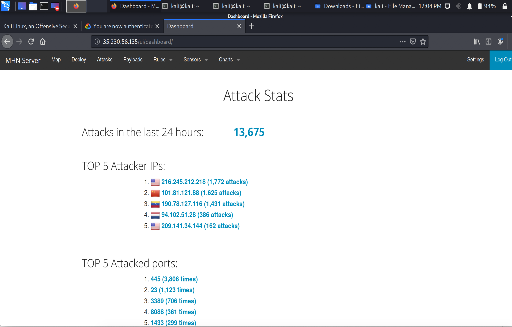

# Honeypot Project

**Time spent:** **6** hours spent in total

**Objective:** Create a honeynet using MHN-Admin. Present your findings as if you were requested to give a brief report of the current state of Internet security. Assume that your audience is a current employer who is questioning why the company should allocate anymore resources to the IT security team.

### MHN-Admin Deployment

I Deployed it using a Google Cloud Instance.

### Dionaea Honeypot Deployment

Dionaea is trying to ultimately gain a copy of an attackers malware script. Once a copy of malware script is obtained a researcher can better understand what the
attacker is trying to exploit. 

### Database Backup 

Mongo DB is the RDBMS that MHN-Admin is using. The information exported to the JSON file record includes the protocol attacked/scanned, timestamp, source ip, source port, destination port, and an identifier. 

